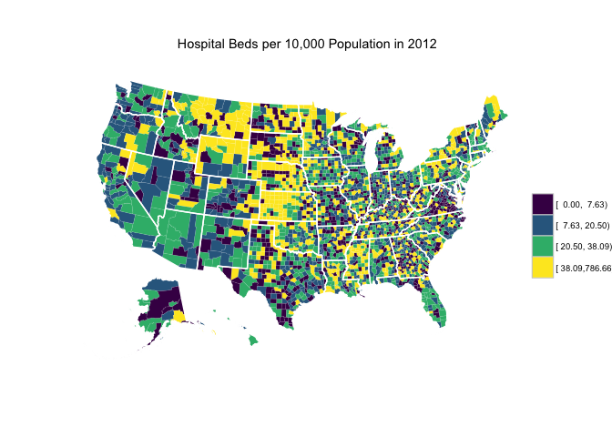

<!-- README.md is generated from README.Rmd. Please edit that file -->
About
=====

[](https://travis-ci.org/jjchern/ahrf) [](https://ci.appveyor.com/project/jjchern/ahrf) [](https://cran.r-project.org/package=ahrf)

This repo contains R scripts (in the [`data-raw` folder](https://github.com/jjchern/ahrf/tree/master/data-raw)) that download county-level and state-level [Area Health Resources Files (AHRF)](http://ahrf.hrsa.gov/download.htm). The datasets are stored in the [`data` folder](https://github.com/jjchern/ahrf/tree/master/data).

AHRF is issued annually. The most recent release is in 2016 (as of July 24, 2017).

For more information on the AHRF files, see <https://datawarehouse.hrsa.gov/topics/ahrf.aspx>.

Installation
============

You can also download the datasets as an R package. The size of `ahrf_county.rda` is 17.5M, so it might take a while to install and load into memory.

``` r
# install.packages("devtools")
devtools::install_github("jjchern/ahrf")

# To uninstall the package, use:
# remove.packages("ahrf")
```

Usage
=====

Load the state file
-------------------

``` r
library(tidyverse)
ahrf::ahrf_state
#> # A tibble: 52 x 1,122
#>    SF00001 SF00002 `SF01201-14` `SF01202-14` `SF01203-14` `SF01204-14`
#>      <chr>   <chr>        <chr>        <chr>        <chr>        <chr>
#>  1      01      AL       010290       007558       002732       001996
#>  2      02      AK       001969       001039            .            .
#>  3      04      AZ       015654       010877       004777       002979
#>  4      05      AR       005698       004063       001635       000828
#>  5      06      CA       101580       064218       037362       017869
#>  6      08      CO       014720       008623       006097       002623
#>  7      09      CT       013741       008745       004996       003031
#>  8      10      DE       002734       001863       000871       000516
#>  9      11      DC       007130       003946       003184       002754
#> 10      12      FL       050556       036039       014517       006760
#> # ... with 42 more rows, and 1116 more variables: `SF01205-14` <chr>,
#> #   `SF01206-14` <chr>, `SF01207-14` <chr>, `SF01208-14` <chr>,
#> #   `SF01209-14` <chr>, `SF01210-14` <chr>, `SF01211-14` <chr>,
#> #   `SF01212-14` <chr>, `SF01220-14` <chr>, `SF01221-14` <chr>,
#> #   `SF01226-14` <chr>, `SF01228-14` <chr>, `SF01229-14` <chr>,
#> #   `SF01099-15` <chr>, `SF01078-14` <chr>, `SF01079-14` <chr>,
#> #   `SF01088-14` <chr>, `SF01089-14` <chr>, `SF01090-14` <chr>,
#> #   `SF01091-14` <chr>, `SF01092-14` <chr>, `SF01093-14` <chr>,
#> #   `SF01101-14` <chr>, `SF01102-14` <chr>, `SF01095-14` <chr>,
#> #   `SF01096-14` <chr>, `SF01097-14` <chr>, `SF01098-14` <chr>,
#> #   `SF02201-14` <chr>, `SF02202-14` <chr>, `SF02203-14` <chr>,
#> #   `SF02204-14` <chr>, `SF02205-14` <chr>, `SF02206-14` <chr>,
#> #   `SF02207-14` <chr>, `SF02208-14` <chr>, `SF02209-14` <chr>,
#> #   `SF02210-14` <chr>, `SF02211-14` <chr>, `SF02212-14` <chr>,
#> #   `SF02221-14` <chr>, `SF02222-14` <chr>, `SF02226-14` <chr>,
#> #   `SF02228-14` <chr>, `SF02229-14` <chr>, `SF02099-15` <chr>,
#> #   `SF02100-15` <dbl>, `SF02078-14` <chr>, `SF02079-14` <chr>,
#> #   `SF02081-14` <chr>, `SF02082-14` <chr>, `SF02083-14` <chr>,
#> #   `SF02084-14` <chr>, `SF02085-14` <chr>, `SF02086-14` <chr>,
#> #   `SF02087-14` <chr>, `SF02088-14` <chr>, `SF02089-14` <chr>,
#> #   `SF02090-14` <chr>, `SF02091-14` <chr>, `SF02092-14` <chr>,
#> #   `SF02093-14` <chr>, `SF02101-14` <chr>, `SF02102-14` <chr>,
#> #   `SF02095-14` <chr>, `SF02096-14` <chr>, `SF02097-14` <chr>,
#> #   `SF02098-14` <chr>, `SF03201-14` <chr>, `SF03202-14` <chr>,
#> #   `SF03203-14` <chr>, `SF03204-14` <chr>, `SF03205-14` <chr>,
#> #   `SF03206-14` <chr>, `SF03207-14` <chr>, `SF03208-14` <chr>,
#> #   `SF03209-14` <chr>, `SF03210-14` <chr>, `SF03211-14` <chr>,
#> #   `SF03212-14` <chr>, `SF03217-14` <chr>, `SF03219-14` <chr>,
#> #   `SF03220-14` <chr>, `SF03221-14` <chr>, `SF03226-14` <chr>,
#> #   `SF03227-14` <chr>, `SF03228-14` <chr>, `SF03229-14` <chr>,
#> #   `SF03230-14` <chr>, `SF03237-14` <chr>, `SF03238-14` <chr>,
#> #   `SF03099-15` <chr>, `SF03100-15` <dbl>, `SF03078-14` <chr>,
#> #   `SF03079-14` <chr>, `SF03080-14` <chr>, `SF03081-14` <chr>,
#> #   `SF03082-14` <chr>, `SF03083-14` <chr>, `SF03084-14` <chr>, ...
```

There're 3230 rows and 6921 columns in the county file (wide format)
--------------------------------------------------------------------

``` r
dim(ahrf::ahrf_county)
#> [1] 3230 6921
```

Variable labels are included
----------------------------

``` r
library(labelled)
ahrf::ahrf_county %>% 
        select(F04437, F00002, contains("F08921"), contains("F11984")) %>% 
        var_label() %>% 
        enframe() %>% 
        unnest()
#> # A tibble: 16 x 2
#>         name                       value
#>        <chr>                       <chr>
#>  1    F04437  County Name w/State Abbrev
#>  2    F00002 Header - FIPS St & Cty Code
#>  3 F08921-13               Hospital Beds
#>  4 F08921-10               Hospital Beds
#>  5 F08921-05               Hospital Beds
#>  6 F11984-15         Population Estimate
#>  7 F11984-14         Population Estimate
#>  8 F11984-13         Population Estimate
#>  9 F11984-12         Population Estimate
#> 10 F11984-11         Population Estimate
#> 11 F11984-09         Population Estimate
#> 12 F11984-08         Population Estimate
#> 13 F11984-07         Population Estimate
#> 14 F11984-06         Population Estimate
#> 15 F11984-05         Population Estimate
#> 16 F11984-95         Population Estimate
```

County-level hospital beds in 2013
----------------------------------

``` r
ahrf::ahrf_county %>% 
        select(county = F04437, 
               fips = F00002, 
               beds_2013 = `F08921-13`,
               pop_2013 = `F11984-13`) %>% 
        mutate(beds_2013 = as.integer(beds_2013),
               pop_2013 = as.integer(pop_2013),
               beds_2013_p10k = beds_2013 / pop_2013 * 10000) -> beds
beds
#> # A tibble: 3,230 x 5
#>          county  fips beds_2013 pop_2013 beds_2013_p10k
#>           <chr> <chr>     <int>    <int>          <dbl>
#>  1  Autauga, AL 01001        50    55246       9.050429
#>  2  Baldwin, AL 01003       364   195540      18.615117
#>  3  Barbour, AL 01005        47    27076      17.358546
#>  4     Bibb, AL 01007        20    22512       8.884151
#>  5   Blount, AL 01009        40    57872       6.911805
#>  6  Bullock, AL 01011        54    10639      50.756650
#>  7   Butler, AL 01013        83    20265      40.957316
#>  8  Calhoun, AL 01015       458   116736      39.233827
#>  9 Chambers, AL 01017       188    34162      55.031907
#> 10 Cherokee, AL 01019        45    26203      17.173606
#> # ... with 3,220 more rows

lapply(beds, summary)
#> $county
#>    Length     Class      Mode 
#>      3230 character character 
#> 
#> $fips
#>    Length     Class      Mode 
#>      3230 character character 
#> 
#> $beds_2013
#>    Min. 1st Qu.  Median    Mean 3rd Qu.    Max.    NA's 
#>     0.0    17.0    50.0   294.6   181.5 25310.0       7 
#> 
#> $pop_2013
#>     Min.  1st Qu.   Median     Mean  3rd Qu.     Max.     NA's 
#>       90    11240    26130    99290    66660 10020000        8 
#> 
#> $beds_2013_p10k
#>    Min. 1st Qu.  Median    Mean 3rd Qu.    Max.    NA's 
#>   0.000   7.391  20.130  30.670  37.270 781.800      13
```

Geographic distribution of hospital beds in 2012
------------------------------------------------


